#  MSF Notes for MST
> Author : Aaron Augustine

> Star the gist so that I can get a consensus on how many people are using this resource

## Shortnotes - 56 Page pdf 

## Theory of Automata :

> The study of abstract machines and the computational problems solved using these machines is called the Theory of Automata.

### Alphabets :
> They are a finite set of symbols. [ Denoted by Σ ]

  

### String :
> They are a finite set of symbols, strung together, from the alphabet.

  

## Transition Diagram :

  
  

## Transition Table :

  ==DFA does not have more than a singular entry in each cell
  NFA can have multiple entries in each cell==

## Finite Auomata ~FA~
> Used to recognize patterns
> It has two states, i.e. , "Accept State " or  " Reject State "

It is a collection of 5 tuples ( Q, **Σ**, **δ**, q0, F )
1. Q : Finite set of states 
2. Σ : Finite set of input symbols
3. δ : Transition Function 
4. q0 : Initial State
5. F : Final State

# Deterministic Finite Automata ~DFA~
o In DFA, there is only one path for specific input from the current state to the next state.
o DFA does not accept the null move, i.e., the DFA cannot change state without any input character.
o DFA can contain multiple final states. It is used in Lexical Analysis in Compiler.

L1 = Set of all strings that start with '0'
 -  { 0, 00, 01, 000, 010, 011, 0000, ....... }

Reference Link for DFA video : 
> [DFA by Neso Academy](https://www.youtube.com/watch?v=40i4PKpM0cI)

Q. Construct a DFA that accepts sets of all strings over {0,1} of length 2
Ans. 
**Σ** = { 0,1 }
L = { 00, 01, 10, 11 }

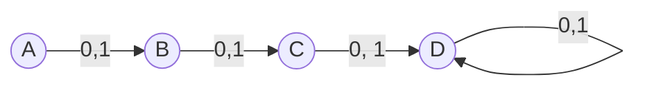

> D here is a dead / trap state

# Non-Deterministic Finite Automata ~NFA~

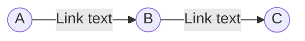

## Questions on transition diagrams and tables

#### Q1. Create the transition function and transition table for the following inputs : 
δ(q~0~,0) = q~0~ 	δ(q~1~,0) = q~1~, q~2~ δ(q~2~,0) = q~1~ 	δ(q~3~,0) = q~2~ 	δ(q~0~,1) = q~1~ 	δ(q~1~,1) = q~2~ 	δ(q~2~,1) = q~3~ 	δ(q~3~,1) = q~2~

Ans. 
### Transition Diagram

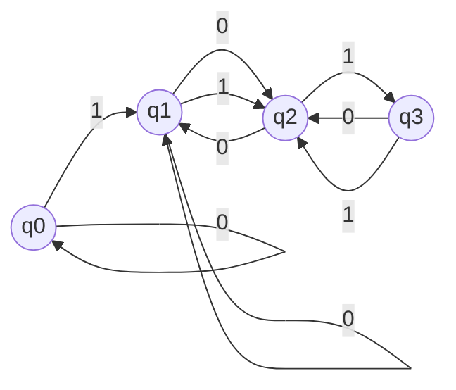

### Transition Table
State\Input| 0 | 1 |
--|--|--|
q0 | q0 | q1 | 
q1 | q2, q2 | q2 |
q2 | q1 | q3 |
q3 | q2 | q2 |
> This is an example of Non deterministic Automata because of q1 accepting 0 as input and going to q1 and q2

#### Q2.  Create the transition function and transition table for the following inputs : 
δ(q~0~,0) = q~1~ 	δ(q~0~,1) = q~2~ δ(q~1~,0) = q~0~ 	δ(q~1~,1) = q~2~ 	δ(q~2~,1) = q~2~ 	δ(q~2~,1) = q~2~ 

Ans. 
### Transition Diagram

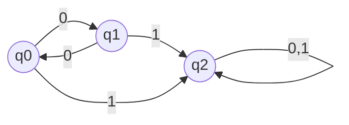

### Transition Table
State\Input| 0 | 1 |
--|--|--|
q0 | q1 | q2 | 
q1 | q0 | q2 |
q2 | q2 | q2 |

#### Q3.  Create the transition function and transition table for the following inputs : 
δ(q~0~,0) = q~0~ 	δ(q~0~,1) = q~1~ δ(q~1~,0) = q~2~ 	δ(q~1~,1) = q~1~ 	δ(q~2~,0) = q~2~ 	δ(q~2~,1) = q~2~ 

Ans. 
### Transition Diagram

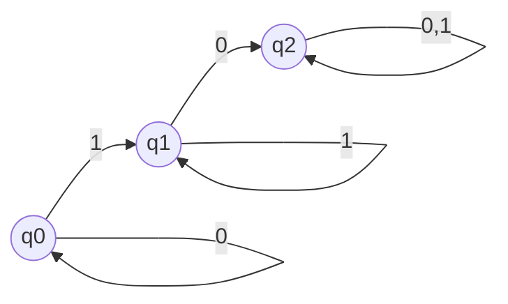

### Transition Table
State\Input| 0 | 1 |
--|--|--|
q0 | q0 | q1 | 
q1 | q2 | q1 |
q2 | q2 | q2 |

#### Q4. Create the transition function and transition table for the following inputs : 
δ(q~0~,0) = q~0~ 	δ(q~0~,1) = q~2~ δ(q~1~,0) = q~0~ 	δ(q~1~,1) = q~2~ 	δ(q~2~,0) = q~2~ 	δ(q~2~,1) = q~2~ 

Ans. 
### Transition Diagram

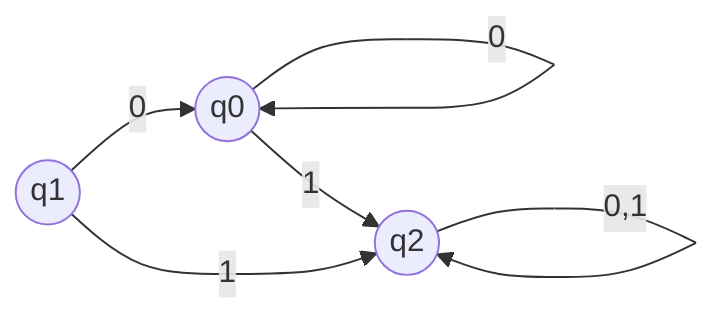

### Transition Table
State\Input| 0 | 1 |
--|--|--|
q0 | q0 | q2 | 
q1 | q0 | q2 |
q2 | q2 | q2 |

## Derivation Trees
Derivation tree is a graphical representation for the derivation of the given production rules for a given CFG. 

#### Ex 1.Generate string a*b+c & draw the derivation tree. 
Given Production rules :
1. E = E+E
2. E = E*E
3. E = a/b/c

*Ans*.
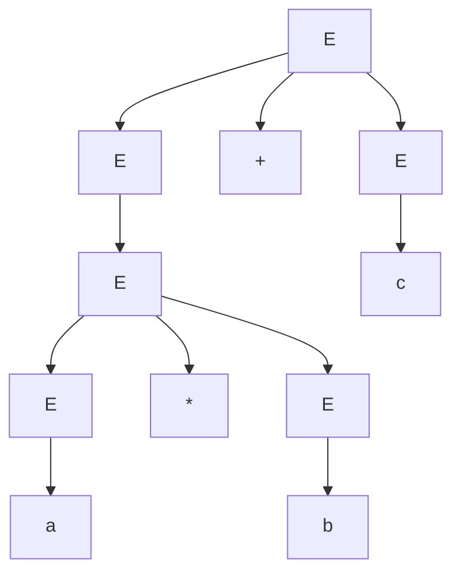

#### Ex 2.Generate string bbabb or bab & draw the derivation tree. 
Given Production rules :
1. s = bsb
2. s = a
3. s= b

*Ans*.

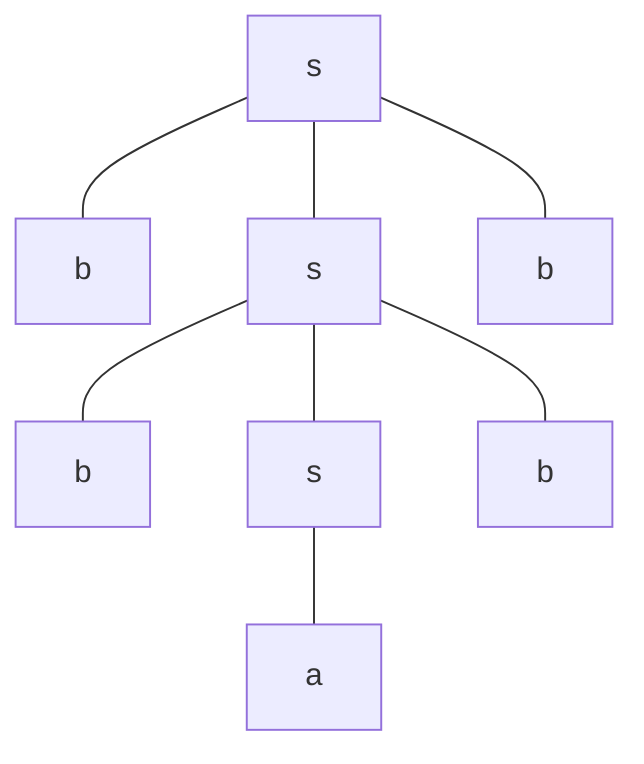

#### Ex 3.Generate string aabbabba & draw the derivation tree. 
Given Production rules :
1. s = ab/ba
2. A = a/as/baa
3. B = b/bs/abb

*Ans*.

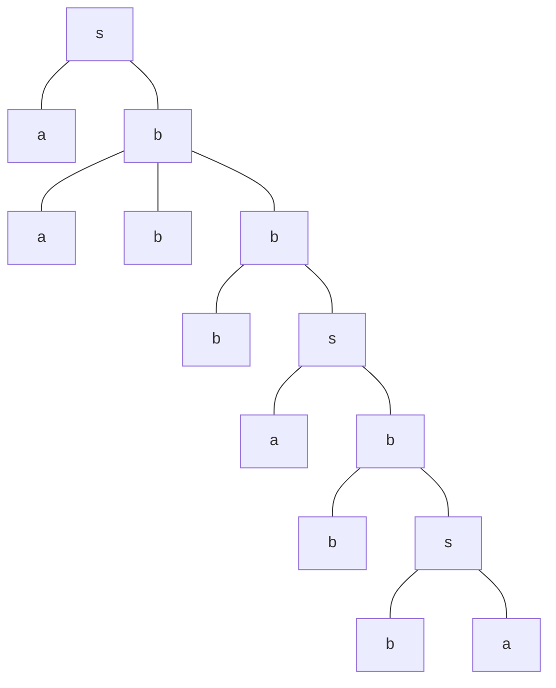

#### Ex 4.Generate string aabbbb & draw the derivation tree.  
Given Production rules :
1. s = ab/e
2. a = ab
3. b = sb

*Ans*.

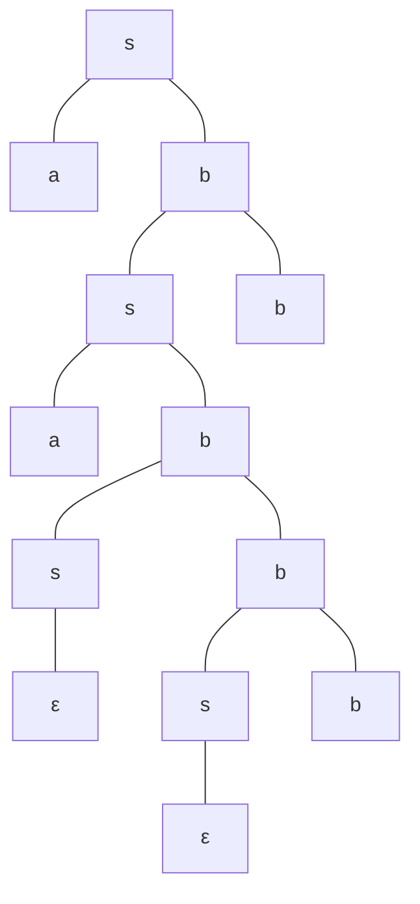

#### Q. What is Regular Expression ?

*Ans*. Regular Expression or RegEx represents a certain set ( collection ) of strings in some algebraic fashion, accepted by FA.

It is the combination of strings and operations, 
*String* : a, b, c, ...... x, y, z, etc 
*Operations* : +, -, /, * 

Types of reg ex are : 
* *Kleene Closure* ( * ) : 
	* a* = {ε, a, aa, aaa,...... }
* *Positive Closure* ( + ) : 
	* a+ : { a, aa, aaa, ..... }
* *Concatenation* ( . ) : 
	* ab = {ab}
* *Union* ( U ) : 
	* ( a + b ) = { a, b }

#### Q. The following are the regular expression ( Regular Expression ) draw their Finite Automata 

1. Φ  : 
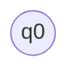

2. ε
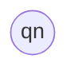

3. a 
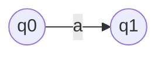
4. a + b
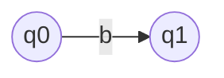
5. ab
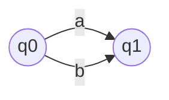
6. ( a + b)

7. a*
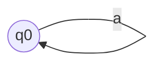
8. a+
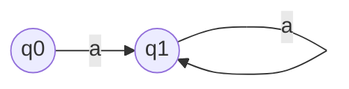

#### Q. What is Abstract Algebra. Explain the following concepts : Group , Ring, Field, and their properties

*Ans*. It is the branch of algebra dealing with the study of algebraic systems or algebraic structures with one or more mathematical operations associated with element from an identifiable pattern, differing from the usual 

* **Group** : A group is a set / collection of strings along with one operation
	* Ex. ( G, . ) or ( G, + )

