#  MSF Notes for MST
> Author : Aaron Augustine

> Star the gist so that I can get a consensus on how many people are using this resource

## PYQ's

#### Q1 a. What is FA finite automata? Write formal definition of finite automata? Draw the finite automata model diagram and explain input tape finite control.

*Ans*. Finite automata (FA), also referred to as finite-state machines, are ideal for recognizing specific patterns within strings of symbols.

**Formal Definition**

A finite automaton is represented by a 5-tuple:

**Q**: A finite set of states.
**∑**: A finite set of input symbols (the alphabet).
**δ**: The transition function, which maps a state and an input symbol to the next state (Q x ∑ → Q).
**q0**: The initial or start state (an element of Q).
**F**: A set of final or accepting states (a subset of Q)

#### Finite Automata Model Diagram

A finite automata diagram is a visual representation of the following:

**States**: Represented as circles.
**Transitions**: Represented as arrows labeled with input symbols. The arrow points from the current state to the next state based on the input.
**Start State**: Marked with a special arrow pointing towards it.
**Accepting States**: Usually marked with double circles.

****
<hr>

#### Q1 b. Draw the transition diagram (graph) and write Transition table represent the DFA M =(Q, E, d, q<sub>0</sub>, F) i.e. M ={{q<sub>0</sub>, q<sub>1</sub>, q<sub>2</sub>},{0, 1}, d, q<sub>0</sub>, {q2}}  where d is transition function given by 
| | |
|--|--|
|d(q<sub>0</sub>, 0) = q<sub>0</sub>, q<sub>1</sub>|d(q<sub>0</sub>, 1 ) = q<sub>1</sub>|
|d(q<sub>1</sub>, 0) = q<sub>2</sub>|d(q<sub>1</sub>, 1 ) = q<sub>0</sub>|
|d(q<sub>2</sub>, 0) = q<sub>2</sub>|d(q<sub>2</sub>, 1 ) = q<sub>1</sub>, q<sub>2</sub>|

*Ans* 
### Transition Diagram


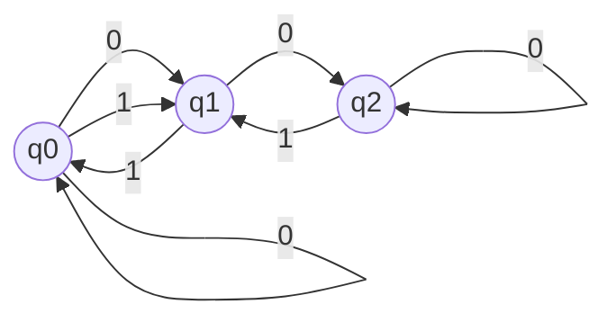


### Transition Table
State\Input| 0 | 1 |
--|--|--|
q0 | q0, q1 | q1 | 
q1 | q2| q0 |
q2 | q0 | q1, q2 |

#### Input Tape and Finite Control

__Input Tape__: A conceptual storage mechanism holding the input string to be processed. It's divided into cells, with each cell containing one input symbol.
__Finite Control__: The brain of the FA. It has a read head that:
- Starts at the leftmost symbol of the input tape.
- Reads one symbol at a time.
- Determines the next state based on the current state and the input symbol using the transition function (δ).
- Moves the read head one cell to the right.


<hr>

#### Q2 a. What is abstract algebra? Explain group, ring, and field. Write properties of group, ring. and field.

*Ans*. It is the branch of algebra dealing with the study of algebraic systems or algebraic structures with one or more mathematical operations associated with element from an identifiable pattern, differing from the usual 

#### Group : 
A group is a set / collection of strings along with one operation
* Ex. ( G, . ) or ( G, + )
This also has the following properties
1. Closure : If & b ∈ S then ( a + b ) ∈ S
2. Associativity : a + ( b + c ) = ( a + b ) + c ( grouping under the sign ) 
3. Identity element : a + 0 = a
4. Inverse element : a + ( -a ) = 0

#### Ring : 
Ring is a set or collection equipped with two binary operations 
* Ex. ( G, +, x )
This also has the following properties
1. Closure ( +, x )
2. Associativity ( +, x )
3. Identity element
4. Inverse element
5. Commutativity : a + b = b + a ( switching under the sign )
6. Distributive law : a( b + c ) = ab + ac

#### Field : 
It is a set / collection of objects  equipped with two binary operations : 
> Main difference b/w field and ring is that that the nonzero elements form an abelian group under multiplication

This also has the following properties
1. Closure ( +, x ) 
2.  Associativity ( +, x )
3. Identity element ( +, x )
4. Inverse element ( +, x )
5. Commutativity ( +, x )
6. Distributive law
7. No zero divisors : If a, b ∈ S & ab = 0, then a = 0 or b = 0

<hr>

#### Q2 b. What is CFG context free grammar
#### Given CFG and Generate the string aabb of given grammar CFG = ( V, T, P, S ) CFG = ( {S}{a, b}, P, S )
Production rule:
	* s = ab
	* s = asb

*Ans* : 
#### Part 1
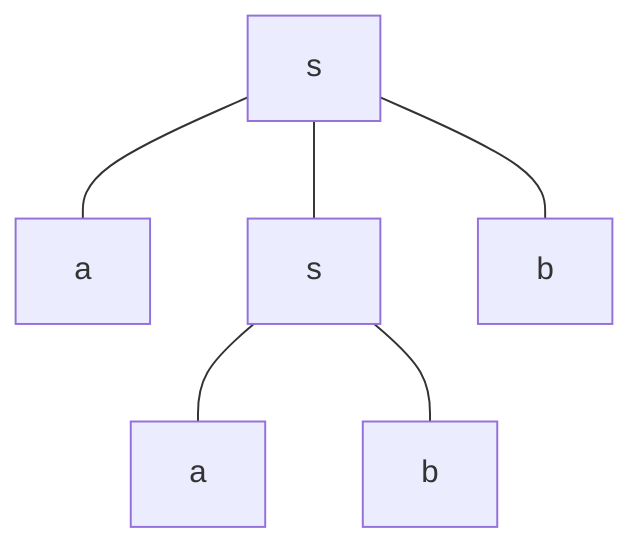

#### Given CFG and generate the string 0101010 of given grammar CFG = ( V, T, P, S ) CFG = ( {S}{0, 1}, P, S )
Production rule: 
	* s=0s0 
	* s =1s1
	* s = 0
	* s = 1
	* s = ∈

*Ans*.
#### Part 2 

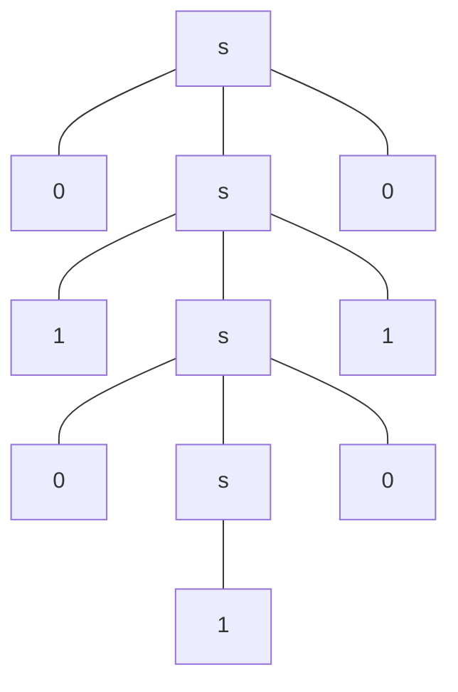

#### Given CFG and generate the string baab of given grammarCFG = ( V, T, P, S ) CFG = ( {S}{0, 1}, P, S )
Production rule: 
	* s = as 
	* s = bs 
	* s = a
	* s = b

*Ans*.

#### Part 3
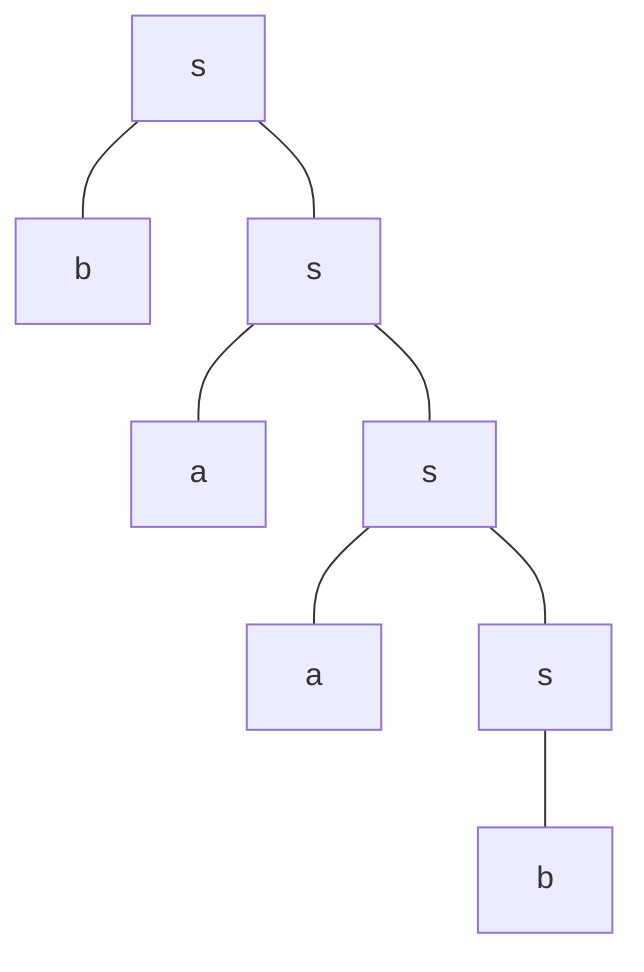

<hr>

#### Q3a. What is derivation tree or parse tree ? Also solve the following
#### Generate the string p*q+r and draw the derivation tree given that production rule is: 
* E=E+E
* E=p/q/r

*Ans* 


#### Generate the string abbbb and draw the derivation tree given that the production rule is: 
* s = axy
* y = x
* y = ∈
* x = byb

*Ans* 


#### Generate the string aabbaa and draw the derivation tree given that the production rule is : 
* s = aas
* s = a
* a = sba
* a = ss
* a = ba

*Ans* 


<hr>

#### Q3 b. Write difference between DFA (deterministic finite automata) and NFA (nondeterministic Finite automata).

*Ans* 


<hr>

#### Q4. What is regular expression? Write the 4 rules of regular expresston Kleene closure(+), concatenation(.), union(U) Draw the finite automata of the given regular expression. The Regular Expression is : 
1. Phi
2. e-Epsilon
3. a
4. b
5. ab
6. a + b
7. a * 
8. a+
9. 01
10. 0 + 1 

*Ans*. Regular Expression or RegEx represents a certain set ( collection ) of strings in some algebraic fashion, accepted by FA.

It is the combination of strings and operations, 
*String* : a, b, c, ...... x, y, z, etc 
*Operations* : +, -, /, * 

Types of reg ex are : 
* *Kleene Closure* ( * ) : 
	* a* = {ε, a, aa, aaa,...... }
* *Positive Closure* ( + ) : 
	* a<sup>+</sup> : { a, aa, aaa, ..... }
* *Concatenation* ( . ) : 
	* ab = {ab}
* *Union* ( U ) : 
	* ( a + b ) = { a, b }

1. Φ (Phi ) 
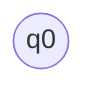

2. ε ( Epsilon ) 
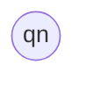
> Should be a double circled node to signify end of regular expression

3. a 
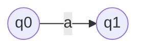

4. b
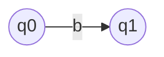

5. ab
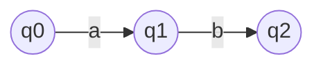

6. ( a + b )
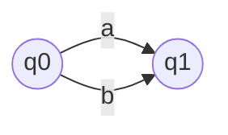

7. a*
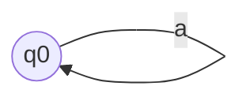

8. a+
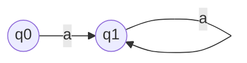

9. 01
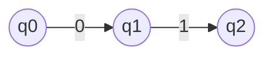

10. 0 + 1
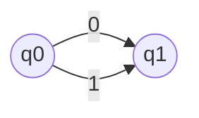

<hr>

#### Q4 b. at is SVM support vector machine how does ? What are types of SVM? Draw a suitable diagram to show this. WHat is a Hyperlane what is support vector? What is margin. What is GMM [Gaussian mixture model]?

*Ans* 

## Shortnotes - 56 Page pdf 

## Theory of Automata :

> The study of abstract machines and the computational problems solved using these machines is called the Theory of Automata.

### Alphabets :
> They are a finite set of symbols. [ Denoted by Σ ]

  

### String :
> They are a finite set of symbols, strung together, from the alphabet.

  

## Transition Diagram :


  
  

## Transition Table :


  ==DFA does not have more than a singular entry in each cell
  NFA can have multiple entries in each cell==

## Finite Auomata ~FA~
> Used to recognize patterns
> It has two states, i.e. , "Accept State " or  " Reject State "

It is a collection of 5 tuples ( Q, **Σ**, **δ**, q0, F )
1. Q : Finite set of states 
2. Σ : Finite set of input symbols
3. δ : Transition Function 
4. q0 : Initial State
5. F : Final State

# Deterministic Finite Automata ~DFA~
o In DFA, there is only one path for specific input from the current state to the next state.
o DFA does not accept the null move, i.e., the DFA cannot change state without any input character.
o DFA can contain multiple final states. It is used in Lexical Analysis in Compiler.

L1 = Set of all strings that start with '0'
 -  { 0, 00, 01, 000, 010, 011, 0000, ....... }

Reference Link for DFA video : 
> [DFA by Neso Academy](https://www.youtube.com/watch?v=40i4PKpM0cI)

Q. Construct a DFA that accepts sets of all strings over {0,1} of length 2
Ans. 
**Σ** = { 0,1 }
L = { 00, 01, 10, 11 }

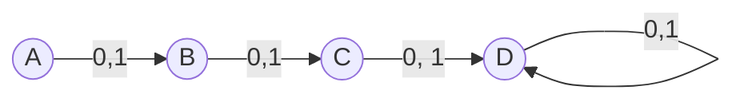

> D here is a dead / trap state

# Non-Deterministic Finite Automata ~NFA~


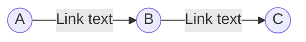


<hr>

## Questions on transition diagrams and tables

#### Q1. Create the transition function and transition table for the following inputs : 
δ(q~0~,0) = q~0~ 	δ(q~1~,0) = q~1~, q~2~ δ(q~2~,0) = q~1~ 	δ(q~3~,0) = q~2~ 	δ(q~0~,1) = q~1~ 	δ(q~1~,1) = q~2~ 	δ(q~2~,1) = q~3~ 	δ(q~3~,1) = q~2~

Ans. 
### Transition Diagram


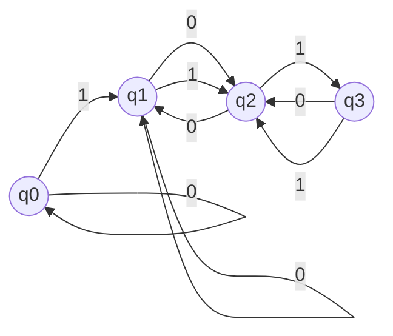


### Transition Table
State\Input| 0 | 1 |
--|--|--|
q0 | q0 | q1 | 
q1 | q2, q2 | q2 |
q2 | q1 | q3 |
q3 | q2 | q2 |
> This is an example of Non deterministic Automata because of q1 accepting 0 as input and going to q1 and q2

<hr>

#### Q2.  Create the transition function and transition table for the following inputs : 
δ(q~0~,0) = q~1~ 	δ(q~0~,1) = q~2~ δ(q~1~,0) = q~0~ 	δ(q~1~,1) = q~2~ 	δ(q~2~,1) = q~2~ 	δ(q~2~,1) = q~2~ 

Ans. 
### Transition Diagram


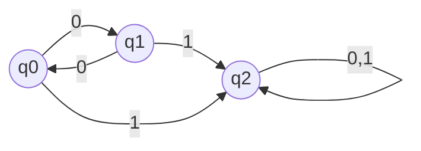


### Transition Table
State\Input| 0 | 1 |
--|--|--|
q0 | q1 | q2 | 
q1 | q0 | q2 |
q2 | q2 | q2 |

<hr>

#### Q3.  Create the transition function and transition table for the following inputs : 
δ(q~0~,0) = q~0~ 	δ(q~0~,1) = q~1~ δ(q~1~,0) = q~2~ 	δ(q~1~,1) = q~1~ 	δ(q~2~,0) = q~2~ 	δ(q~2~,1) = q~2~ 

Ans. 
### Transition Diagram


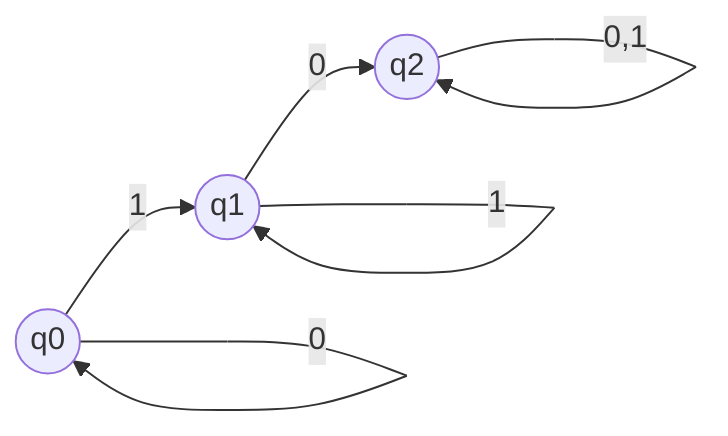


### Transition Table
State\Input| 0 | 1 |
--|--|--|
q0 | q0 | q1 | 
q1 | q2 | q1 |
q2 | q2 | q2 |

<hr>

#### Q4. Create the transition function and transition table for the following inputs : 
δ(q~0~,0) = q~0~ 	δ(q~0~,1) = q~2~ δ(q~1~,0) = q~0~ 	δ(q~1~,1) = q~2~ 	δ(q~2~,0) = q~2~ 	δ(q~2~,1) = q~2~ 

Ans. 
### Transition Diagram


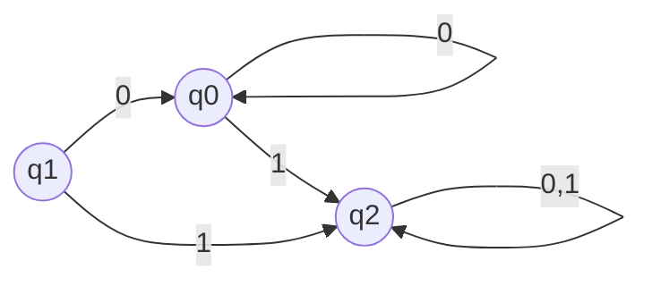


### Transition Table
State\Input| 0 | 1 |
--|--|--|
q0 | q0 | q2 | 
q1 | q0 | q2 |
q2 | q2 | q2 |

<hr>


## Derivation Trees
Derivation tree is a graphical representation for the derivation of the given production rules for a given CFG. 

#### Ex 1.Generate string a*b+c & draw the derivation tree. 
Given Production rules :
1. E = E+E
2. E = E*E
3. E = a/b/c

*Ans*.
```mermaid
flowchart TD
	A[E] --> B[E];
	A --> C[+];
	A --> D[E];
	B --> E[E];
	E --> F[E];
	E --> G[*];
	E --> H[E];
	F --> I[a];
	H --> J[b];
	D --> K[c]
```

<hr>

#### Ex 2.Generate string bbabb or bab & draw the derivation tree. 
Given Production rules :
1. s = bsb
2. s = a
3. s= b

*Ans*.

```mermaid
flowchart TD
	A[s] ---B[b]
	A ---C[s]
	A ---D[b]
	C ---E[b]
	C ---F[s]
	C ---G[b]
	F ---H[a]

```

<hr>

#### Ex 3.Generate string aabbabba & draw the derivation tree. 
Given Production rules :
1. s = ab/ba
2. A = a/as/baa
3. B = b/bs/abb

*Ans*.

```mermaid
flowchart TD
	A[s]---B[a]
	A---C[b]
	C---D[a]
	C---E[b]
	C---F[b]
	F---G[b]
	F---H[s]
	H---I[a]
	H---J[b]
	J---K[b]
	J---L[s]
	L---M[b]
	L---N[a]
	

```

#### Ex 4.Generate string aabbbb & draw the derivation tree.  
Given Production rules :
1. s = ab/e
2. a = ab
3. b = sb

*Ans*.

```mermaid
flowchart TD
	a[s]---b[a]
	a---c[b]
	c---d[s]
	c---e[b]
	d---f[a]
	d---g[b]
	g---h[s]
	g---i[b]
	h---j[ε]
	i---k[s]
	i---l[b]
	k---m[ε]
	
```

<hr>

#### Q. The following are the regular expression ( Regular Expression ) draw their Finite Automata 

*Ans*.

1. Φ (Phi ) 
```mermaid
graph LR
	A((q0))
```

2. ε ( Epsilon ) 
```mermaid
graph LR
	A((qn))
```
> Should be a double circled node to signify end of regular expression

3. a 
```mermaid
graph LR
	A((q0))--a--> B((q1))
```

4. b
```mermaid
graph LR
	A((q0))--b--> B((q1))
```

5. ab
```mermaid
graph LR
	A((q0))--a-->B((q1))--b-->c((q2))
```

6. ( a + b )
```mermaid
graph LR
	A((q0))--a-->B((q1))
	A--b-->B
```

7. a*
```mermaid
graph LR
	A((q0))
	A--a-->A
```

8. a+
```mermaid
graph LR
	A((q0))--a-->B((q1))
	B--a-->B
```
<hr>


#### Q. What is Machine Learning, what are the types of machine learning ? Draw the classification tree for types of machine learning.

*Ans* 

```mermaid
flowchart TD
A[Machine Learning] ----> B[Supervised] & C[Unsupervised] & D[Reinforcement]
B----> E[Classicfication] & F[Regression] 
C----> G[Clustering] & H[Association]
E---->I[SVM : Support Vector Machine ]
G--->L[GMM : Gaussian Mixture Model ] & M[K-Means]

```


#### Q. What are the types of SVM ? Draw the classification tree diagram and explain them with graphs. What is Hyper plane and support vector ?

*Ans* Support Vector Machine [SVM] Is a form of classification in *Supervised* machine learning.

```mermaid
flowchart TD 
A[Support Vector Machine]--->B[ Linear SVM ] & C[Non-Linear SVM / Kernel]
```
#### Linear SVM


****
****
>  Negative Hyperplane in the image below
****

| Symbol | Name | Meaning | 
|--|--|--|
| ---- |Hyperplane | Straight Line dividing two sets of datapoints|
|*/x | Support Vectors | Data points from different sets, closest to the margins |
| *-/-x | Margin | It is the distance between the support vector and the hyperplane }


#### Non Linear SVM 

****

<hr>


   
