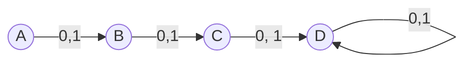
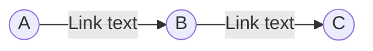

<title>MSF Notes</title>

  

# MSF Notes for MST

## Theory of Automata :

  

> The study of abstract machines and the computational problems solved using these machines is called the Theory of Automata.

  

### Alphabets :

> They are a finite set of symbols. [ Denoted by Σ ]

  

  

### String :

> They are a finite set of symbols, strung together, from the alphabet.

  

  

## Transition Diagram :

  

  

  

## Transition Table :

  

  
  

==DFA does not have more than a singular entry in each cell

NFA can have multiple entries in each cell==

  

## Finite Auomata ~FA~

> Used to recognize patterns

> It has two states, i.e. , "Accept State " or " Reject State "

  

It is a collection of 5 tuples ( Q, **Σ**, **δ**, q0, F )

1. Q : Finite set of states

2. Σ : Finite set of input symbols

3. δ : Transition Function

4. q0 : Initial State

5. F : Final State

  

# Deterministic Finite Automata ~DFA~

L1 = Set of all strings that start with '0'

- { 0, 00, 01, 000, 010, 011, 0000, ....... }

  

Reference Link for DFA video :

> [DFA by Neso Academy](https://www.youtube.com/watch?v=40i4PKpM0cI)

  

Q. Construct a DFA that accepts sets of all strings over {0,1} of length 2

Ans.

**Σ** = { 0,1 }

L = { 00, 01, 10, 11 }

  
  

  

> D here is a dead / trap state

  

# Non-Deterministic Finite Automata ~NFA~

  
  

